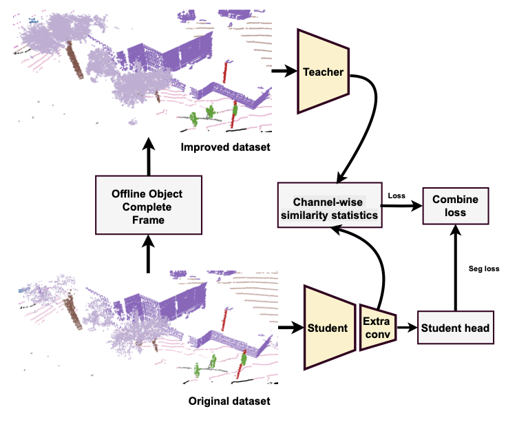
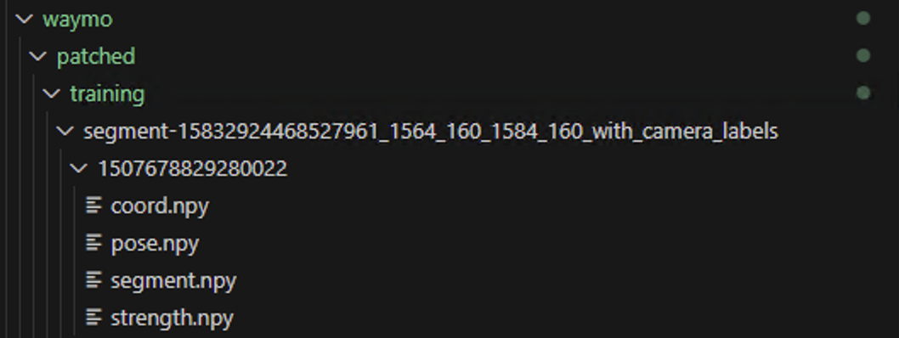

# AAAI 2026: 3D Semantic Segmentation with Knowledge Distillation for Dynamic-Size Feature Maps




### Abstract

This paper presents a plug-in framework for improving LiDAR-based 3D semantic segmentation. By aggregating multiple frames, we reconstruct denser and more complete point clouds, which act as supervision for a knowledge distil- lation process invariant to feature-map dimensionality. The student model thus benefits from enriched representations while maintaining standard single-frame inference. On the large-scale Waymo Open Dataset, our approach improves segmentation performance by 0.5–3% in mIoU and 0.4-1.1% in overall accuracy (allAcc) compared to the baseline student model, demonstrating consistent gains on challenging out- door scenes.

## Demo

All videos are hosted on google platform.

- [Demo AAAI 2026](https://drive.google.com/drive/folders/1XVmy2st5FB3VIO_Rh1TlWaMjpohc2D2y?usp=sharing)

Experiments

Base
| Model  | Clip |  Patched all | mIoU | allAcc
|-------|-----|-------| ------- | ------- |
| PTv3 | yes  | -- | 69.6  | 94.1 |
| PTv3   | yes  | --   | 67.9 | 93.8 |


Teacher
| Model  | Clip |  Patched all | mIoU | allAcc
|-------|-----|-------| ------- | ------- |
| PTv3 | yes  | yes | 71.3  | 92.8|
| PTv3   | yes  | no   | 73.0 | 97.0 |
| PTv3   | no  | no   | 75.3 | 97.8 |
| SpUNet | yes  | yes | 73.2  | 93.4|
| SpUNet   | yes  | no   | 77.3 | 97.1 |
| SpUNet   | no  | no   | 78.7 | 97.9 |


Distillation
| Model  | Strategies |  mIoU | allAcc | mAcc
|-------|-----|-------| ------- | ------- |
| PTv3 | Backbone  | 68.2 | 93.9 | 79.0 |
| PTv3   | KNN + pair  | 68.3 | 93.9 | 77.4 |
| PTv3   | Channel-Wise  | 70.1 | 94.5 | 80.0 |
| SpUNet | Backbone  | 68.9  |94.1  |79.5 |
| SpUNet   | KNN + pair  | 69.6 | 94.2 | 80.1 |
| SpUNet   | Channel-Wise  | 70.9 | 94.9 | 80.8 |


# Waymo

## Prepare dataset

We using  [Pointcept](https://github.com/Pointcept/Pointcept) as main framework for training model 

1. Download Pointcept and setup requirements
2. Prepare dataset Waymo (we use v1.4.2)

```
python pointcept/datasets/preprocessing/waymo/preprocess_waymo.py --dataset_root your_path --output_root your_path--splits training validation --num_workers N
```

3. Patch dataset Waymo

```
python patch_scene_pointcept.py --dataset pointcept --dataroot your_path --num_workers N
```




## Base training

Quick start

[Training-Pointcept](https://github.com/Pointcept/Pointcept?tab=readme-ov-file#training)

Configs for base training:

- Pointcept/configs/scannet_base
- Pointcept/configs/waymo_base

Configs for teacher training:

- Pointcept/configs/scannet_teacher
- Pointcept/configs/waymo_teacher


Configs for distillation training:

- Pointcept/configs/scannet_distill
- Pointcept/configs/waymo_distill


# Acknowledgements

- [`Pointcept`](https://github.com/open-mmlab/OpenPCDet) is used for training supervised models.